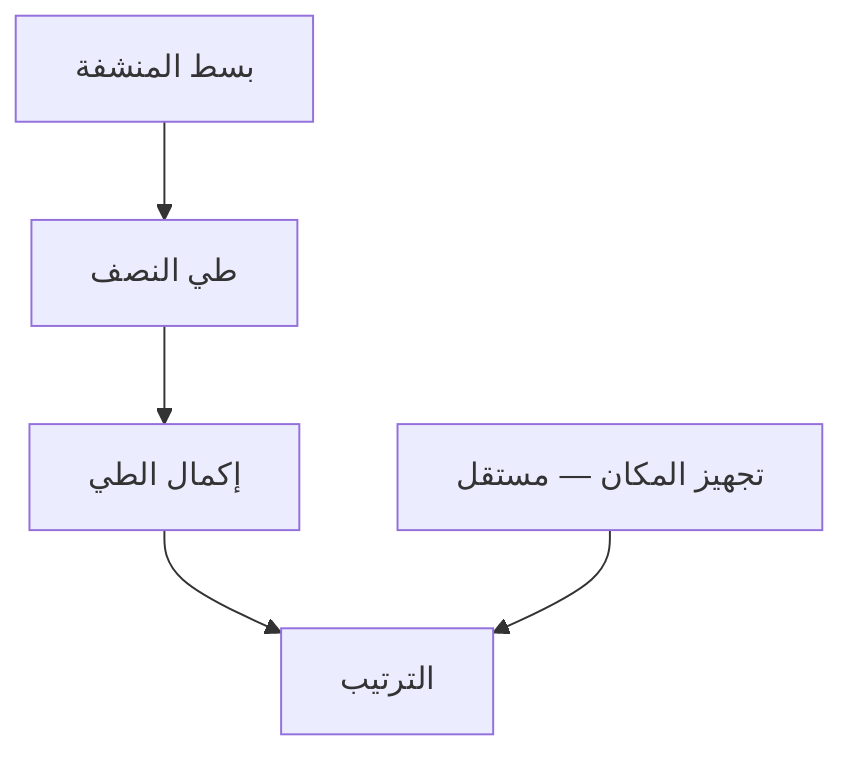
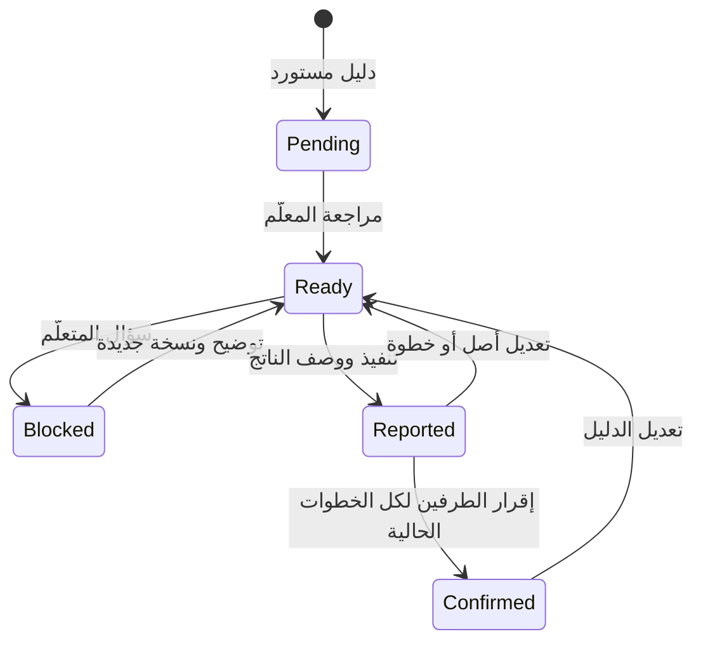
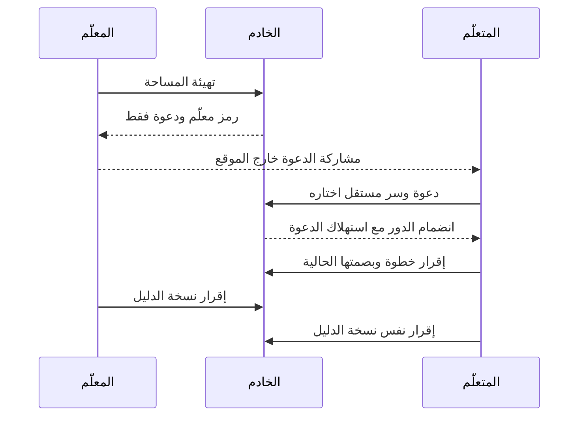
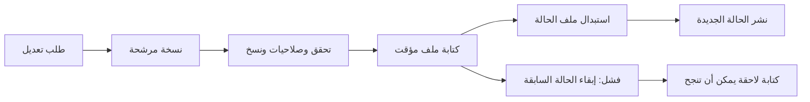
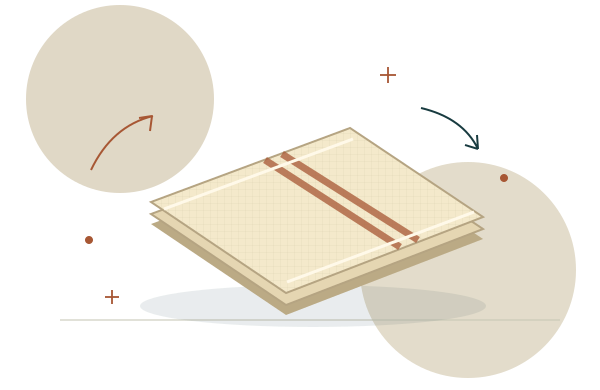
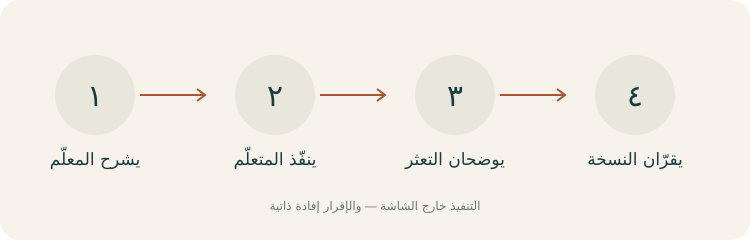
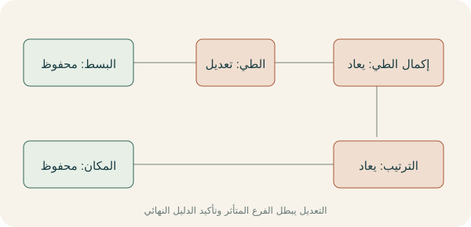

# صنعة

موقع عربي مستقل يحوّل مهارة يعرفها فرد من الأسرة إلى دليل يجربه فرد آخر. يشرح المعلّم الأدوات والخطوات، ينفّذ المتعلّم خارج الشاشة، يسجل موضع التعثر، ويضيف المعلّم توضيحًا. ينتج دليل مرتبط بنسخ الخطوات يمكن طباعته والاحتفاظ به.

النموذج جاهز للعرض المحلي. مثال «طيّ المنشفة مثل جدتي» مؤلف؛ لا أسماء أشخاص أو تجارب ميدانية أو نسب تحسن. الاستخدام العملي لا يحتاج ذكاءً اصطناعيًا.

## التشغيل

يلزم Node.js 22 أو أحدث وnpm المصاحب له. لا حزم خارجية ولا خطوة `npm install`.

```sh
npm start
# افتح http://127.0.0.1:4313
npm test
npm run build
npm run verify
```

`verify` يشغّل الاختبارات كاملة ثم يتحقق من صياغة الوحدات ويجهز ملفات تشغيل مستقلة في `dist/`. يمكن تشغيل الناتج بأمر `node dist/server.mjs`. ملف `dist/build-manifest.json` يسجل بصمات ملفات الإنتاج، دون بيانات المستخدم أو الأسرار.

على Windows يمكن ضبط المنفذ ومسار بيانات لمساحة مستقلة:

```powershell
$env:PORT='4314'
$env:DATA_FILE='./data/another-workspace.json'
npm start
```

الخادم مرتبط بـ `127.0.0.1` فقط، ويخزن حالة المساحة في `data/state.json` افتراضيًا. البيانات و`dist/` و`.env` مستبعدة من Git. كل خادم يدير مساحة واحدة ومعه معلّم واحد ومتعلّم واحد؛ لا تشغّل خادمين على ملف حالة واحد.

## رحلة عرض عملية

1. افتح الموقع واختر «ابدأ بمثال عملي». احفظ رمز المعلّم ودعوة المتعلّم التي تظهر مرة واحدة.
2. أعط الدعوة للطرف الآخر. يفتح نافذة مستقلة للموقع ثم «دخول برمز» ← «انضمام المتعلّم بدعوة»، ويختار سر دخول خاصًا من ١٢ حرفًا على الأقل. الدعوة تنتهي خلال ٢٤ ساعة وتُستهلك مرة واحدة؛ المعلّم لا يرى سر المتعلّم ولا يستطيع إعادة دعوته بعد الانضمام.
3. ادخل كمعلّم برمز المعلّم. راجع الأدوات والخطوات ورسم متطلباتها، أو أنشئ دليلًا جديدًا حتى ١٢ خطوة مع مراجعة قبل النشر.
4. في نافذة المتعلّم، نفّذ «نبسط المنشفة» فعلًا، ثم صف الناتج وحدد إقرار التنفيذ. حاول فتح «نطوي نصفًا على نصف» قبل ذلك لمشاهدة انتظار المتطلب.
5. سجّل تعثرًا في الطيّ مثل «كيف أطابق الحافتين؟». يوضح المعلّم الحركة من حسابه. يضاف التوضيح إلى نسخة جديدة، ويعود المتعلّم لتجربتها. زر التحديث يجلب رد الطرف الآخر؛ لا إرسال بالنيابة عنه.
6. أكمل الفرع المستقل «نجهز مكانًا لها»، وبقية الخطوات. كل طرف يقر النسخة من حسابه بعد اكتمال الخطوات. عندها يظهر «جرّبه عضو آخر وأقرّ الطرفان هذه النسخة» بمعنى إفادتين من دورين مستقلين، وليس تحققًا من هوية بشرية.
7. عدّل نص الطيّ من حساب المعلّم: إقرارات الطي وإكماله والترتيب تُعاد، بينما تبقى إقرارات البسط وتجهيز المكان. الرسم وسجل النسخ يوضحان الأثر. إقرار النسخة النهائي يعود للانتظار.
8. اطبع الدليل أو نزّل HTML مستقلًا أو صدّر JSON. الاستيراد يمحو الثقة في الإقرارات المنقولة، ويبدأ مراجعة وتجربة جديدتين.

## آلية النسخ والاعتماد

كل إنشاء أو استيراد يولّد هوية دليل عشوائية جديدة `instanceId` من الخادم، دون الثقة بمعرّف الملف المستورد. تدخل الهوية في بصمات جميع الخطوات وإقرار الدليل، فيرفض النظام إقرارات جولة سابقة حتى مع تطابق المحتوى. كل خطوة لها معرّف وتعليمات ومتطلبات ورقم نسخة وبصمة سياقية. البصمة تربط المحتوى ورقم النسخة ببصمات المتطلبات، لذلك يتغير سياق التوابع عند تغيير أصلها. إعادة النص إلى قيمته السابقة لا تعيد صلاحية إقرار قديم. تحفظ النسخ السابقة وأحداث الإنجاز الأصلية للتوثيق، ولا تحتسبها ضمن الحالة الحالية.

المتعلم لا يستطيع تسجيل الإنجاز قبل متطلبات نسخها الحالية، ولا تسجيل خطوة معلقة على سؤال مفتوح. توضيح المعلّم لا يقر التنفيذ؛ يحتاج محاولة فعلية جديدة من المتعلّم. الإقرار النهائي يتطلب جميع الخطوات الحالية، ثم تأكيدين منفصلين على بصمة نسخة الدليل نفسها.

حفظ كل عملية يجري على نسخة مرشحة من الحالة: تحقق → حفظ ملف مؤقت → استبدال الملف → نشر الحالة. إذا فشل الحفظ تبقى الحالة المنشورة السابقة سليمة، ويمكن أن تنجح كتابة لاحقة.

## المعمارية

```mermaid
flowchart RTL
  Browser[واجهة عربية RTL] --> HTTP[خادم Node HTTP]
  HTTP --> Auth[صلاحيات bearer ودعوة أحادية]
  Auth --> Domain[محرك النسخ والتجربة]
  Domain --> Store[تخزين JSON بمعاملة حفظ]
  HTTP --> Print[HTML للطباعة وتصدير JSON]
  HTTP -. موافقة المعلّم .-> Gemini[Gemini اختياري]
```

```mermaid
flowchart RTL
  Explain[المعلّم يشرح] --> Practice[المتعلّم ينفذ خارج الشاشة]
  Practice --> Outcome[يصف الناتج]
  Practice --> Block[يسجل سؤالًا عند التعثر]
  Block --> Clarify[المعلّم يوضح نسخة الخطوة]
  Clarify --> Practice
  Outcome --> Both[إقرار الطرفين للنسخة الحالية]
  Both --> Printed[دليل قابل للطباعة]
```









```mermaid
flowchart RTL
  Notes[ملاحظات المعلّم] --> Consent{موافقة إرسال النص؟}
  Consent -->|نعم| API[Gemini مع مهلة ومخطط JSON]
  API --> Draft[مسودة غير منشورة]
  Draft --> Review[مراجعة وتعديل المعلّم]
  Review --> Publish[نشر بقرار بشري]
  API -->|خطأ أو مهلة| Manual[المحرر اليدوي]
  Consent -->|لا| Manual
```

## رسوم توضيحية مستقلة







رسم المتطلبات الحي في الواجهة SVG محسوب من DAG الحقيقي؛ الرسوم الثلاثة أعلاه توضيحات أصلية لا تُستعمل لإثبات نتائج.

## Gemini الاختياري

اضبط `GEMINI_API_KEY` على الخادم فقط، و`GEMINI_MODEL` إذا أردت نموذجًا آخر. الافتراضي `gemini-3.5-flash-lite`، وفق [قائمة نماذج Google الرسمية](https://ai.google.dev/gemini-api/docs/models) التي روجعت في 8 أكتوبر 2026. لا تدخل المفتاح في الواجهة أو ملف المشاركة أو Git.

المهايئ يستدعي `POST /v1beta/models/{model}:generateContent` بترويسة `x-goog-api-key`، ومخطط `responseJsonSchema`، و`responseMimeType: application/json` وفق [مرجع generateContent](https://ai.google.dev/api/generate-content). مهلة الطلب ١٢ ثانية، ويعيد التحقق محليًا من الحقول والمتطلبات والدورات. يحتاج موافقة صريحة قبل إرسال نص الملاحظات لخدمة خارجية؛ الناتج مسودة تعاد للمعلّم ولا تُحفظ أو تُنشر حتى يراجعها.

لا مفتاح مقدم ولا اتصال حي مجرب. الاختبارات تستخدم خوادم HTTP محلية تحاكي الرد والرد غير الصالح وانتهاء المهلة، مع تحقق عدم نشر المسودة. عند غياب المفتاح أو أي خطأ يعمل المحرر اليدوي.

## التحقق والحدود

`npm test` يشمل ١٨ اختبارًا: الدورات والمراجع وحد ١٢ خطوة، المتطلبات، الصلاحيات، النسخ، الفروع، إعادة إقرار تابع قديم، الدعوة المستقلة، انتهاء الرموز، الاستيراد، تصدير بلا أسرار، طباعة مرمزة، حفظ متعثر فعلي ثم كتابة ناجحة، وGemini المحاكى. يتضمن مرجع وصول مستقل ٦٤ رسمًا × ٤ تغييرات = ٢٥٦ مقارنة. خادم HTTP يعمل فعليًا داخل الاختبارات بمنفذ محلي عشوائي.

الأسرار المخزنة بصمات SHA-256 مع انتهاء ٣٠ يومًا؛ الرمز في جلسة التبويب فقط. الأفضل للمتعلّم اختيار عبارة طويلة يصعب تخمينها. لا استرجاع أو إعادة دعوة بعد الانضمام. الدعوة نفسها لا تمنع منشئ المساحة من فتحها أولًا؛ الحد التقني يمنع كشف سر اختاره متعلّم آخر أو استخدام حساب المعلّم لإقراره. لا تحقق هوية بشرية أو مقابلة حضورية أو دليل تلقائي على تنفيذ خارج الشاشة.

الخادم يتحقق من الأصل والمضيف، يقيد الجسم بـ٦٤ كيلوبايت، ويمنع تشغيل النص كـHTML. طباعة HTML تتضمن التعليمات ومتطلباتها والنسخ والتوضيحات، دون رموز الدخول. لا أسماء أو بيانات اتصال أو تسجيل محتوى الملاحظات في console. هذا نموذج localhost؛ نشره للإنترنت يتطلب تصميم حسابات واسترجاع وتشفير نقل وحماية من التخمين ونسخ احتياطية وتحقق أوسع.

مقاييس المحاولات والتعثر إفادات مسجلة لا دليل جودة أو سلامة أو أثر أسري. لم نجمع مستخدمين أو نحسن الحوار بقياس ميداني. دراسة لاحقة تقارن قدرة المتعلّم على إعادة المهارة وسهولة الاستخدام بدليل في مستند مشترك، دون افتراض النتيجة.

## البدائل والفرق المحدود

| البديل | ما يقدمه بحسب صفحته الرسمية | ما نعرضه في صنعة |
|---|---|---|
| [Morsel](https://getmorsel.com/) | وصفات الأسرة، مذكرات صوتية، أسئلة وتعليقات على التجربة | نسخ سياقية للخطوة، متطلبات فعلية، وإعادة تجربة الفرع المتأثر |
| [Gigi](https://www.gigicc.com/) | كتب وصفات خاصة ومشاركة وتحرير تعاوني | التجربة مرتبطة بدور مستقل ونسخة بعينها، وتحتاج إقرار الطرفين |
| [Scribe](https://scribe.com/) | التقاط إجراءات العمل وإنشاء توثيق وإرشادات | تعلم مهارة مادية خارج الشاشة ودليل يوضح موضع التعثر |

حفظ المهارات أو الوصفات والتعليق عليها والتحرير العائلي أفكار موجودة. الفرق هنا محدد في تنفيذ دورة التجربة والنسخ ومتطلبات الخطوات؛ لا ادعاء اختراع أو براءة أو جدة عالمية، ولا نفترض غياب خصائص لم تذكرها صفحات المنافسين. راجع [سجل المصادر](docs/sources.md) و[تقرير التنفيذ](docs/implementation-report.md).


